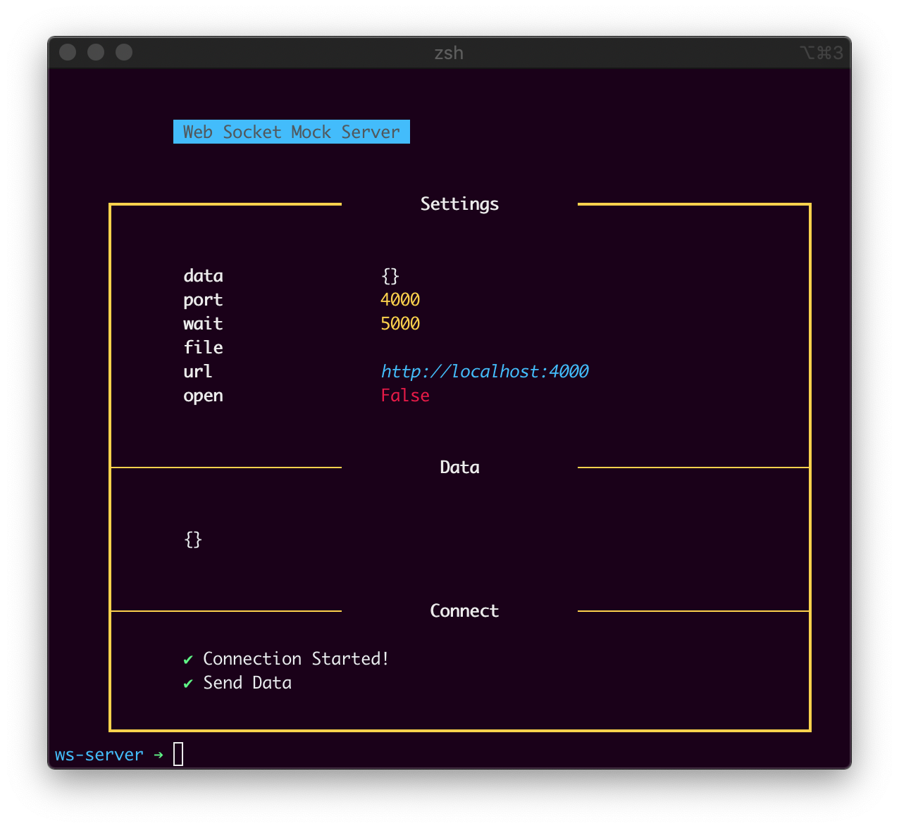

# WS Launch

A Web Socket Mock data launcher



### Installation

To start the project;

```
npm install
```

### Run

```
npm start
```

or with npx;

```
npx ws-launch
```

### Settings

| Settings | Default | Argument | Description                 |
| -------- | ------- | -------- | --------------------------- |
| Port     | `4000`  | `--port` | On which port should it run |
| Data     | `{}`    | `--data` | Json string with data       |
| File     | ''      | `--file` | Json file with data         |
| Wait     | `5000`  | `--wait` | Wait in ms to fire the data |
| Open     | false   | `--open` | Keep the connection open    |

If you want any other data, you can pass arguments like;

```
npm start -- --port=5000 --data=test.json
```

### Inline data

You can use inline json data.

```
npx ws-launch --data="{}"
```

Your json needs to be stringified and escaped.

### Converter

<iframe src="docs/convert.html" style="width: 100%; height: 50vh; min-height: 320px; border: none;"></iframe>
